# Course Project Intelligence MCP Server

<p align="center">
  
</p>

<p align="center">
  <a href="README.md"><strong>English</strong></a>
  ·
  <a href="README.zh-CN.md">中文</a>
  ·
  <a href="docs/readme-showcase.html">CSS showcase</a>
  ·
  <a href="docs/readme-showcase.zh-CN.html">中文展示页</a>
</p>

<p align="center">
  
  
  
  
</p>

Course Project Intelligence is a GitHub-focused MCP server that helps AI agents discover, inspect, compare, and package public university computer-science course project repositories as safe learning references.

It is designed for hosts such as Trae, Claude Code, Cursor, and other Model Context Protocol clients. The server keeps the source visible, classifies risk, and makes it harder for downstream agents to confuse public repositories with official course material.

## What It Does

| Capability | Output |
| --- | --- |
| Discover GitHub course repositories | Ranked public repositories with course/project signals |
| Inspect a known repository | Usable parts such as README, src, report, SQL, schema, notes, labs, assignments, and docs |
| Compare candidate repositories | Similarities, differences, recommended usage, and safety notes |
| Build an Evidence Pack | Agent-readable context cards with attribution, risk flags, and citation hints |
| Route host requests | Stable MCP tools for search, inspection, comparison, and context construction |

## Dynamic README Notes

GitHub README files do not execute custom JavaScript and sanitize most inline CSS. This repository therefore uses a GitHub-compatible approach:

- animated SVG artwork in `assets/readme-hero.svg`
- badge-based status blocks that render in Markdown
- language file switching between `README.md` and `README.zh-CN.md`
- full CSS and animation preview pages in `docs/readme-showcase.html` and `docs/readme-showcase.zh-CN.html`

## Tool Surface

| MCP tool | Purpose |
| --- | --- |
| `search_course_projects` | Search public GitHub repositories related to university CS course projects, labs, assignments, reports, source code, SQL/schema, notes, and course design references. |
| `search_course_resources` | A broader GitHub course-resource wrapper that reuses the project search stack. |
| `inspect_course_project` | Inspect a GitHub repository URL or `owner/name` identifier and identify usable learning-reference parts. |
| `compare_course_projects` | Compare multiple public GitHub repositories as candidate learning references. |
| `build_course_context` | Build an agent-readable Evidence Pack from search, inspect, compare, or provided GitHub source URLs. |
| `get_project_brief` | Extract a lightweight repository brief with summary, inferred course/school, tech stack, project type, and risk note. |
| `compare_project_routes` | Compare repository routes, modules, stack choices, and learning paths. |
| `list_course_resources` | List public GitHub resources for a course. |

## Recommended Workflow

```text
GitHub search
        -> search_course_projects / search_course_resources
        -> inspect_course_project
        -> compare_course_projects
        -> build_course_context
        -> grounded agent answer
```

Use `search_course_resources` for broad discovery, `inspect_course_project` for a known repository, `compare_course_projects` for choosing between candidates, and `build_course_context` before an agent writes a final grounded answer.

## Quick Start

Create and activate a virtual environment:

```bash
python -m venv .venv
```

Linux/macOS:

```bash
source .venv/bin/activate
python -m pip install -U pip
python -m pip install -e .
```

Windows PowerShell:

```powershell
.\.venv\Scripts\Activate.ps1
python -m pip install -U pip
python -m pip install -e .
```

Run with stdio:

```bash
python -m app.main --transport stdio
```

Run with Streamable HTTP:

```bash
python -m app.main --transport http --host 127.0.0.1 --port 8000 --mount-path /mcp
```

Default HTTP endpoint:

```text
http://127.0.0.1:8000/mcp
```

## Host Integration

| Host | Examples |
| --- | --- |
| Trae | [README](examples/trae/README.md), [python stdio](examples/trae/python-stdio.mcp.json), [stdio](examples/trae/stdio.mcp.json), [http](examples/trae/http.mcp.json) |
| Cursor | [README](examples/cursor/README.md), [python stdio](examples/cursor/python-stdio.mcp.json), [stdio](examples/cursor/stdio.mcp.json), [http](examples/cursor/http.mcp.json), [mcp](examples/cursor/mcp.json) |
| Claude Code | [README](examples/claude-code/README.md), [python stdio](examples/claude-code/stdio-python.txt), [stdio cli](examples/claude-code/stdio-cli.txt), [http](examples/claude-code/http.txt) |

## Documentation

- [Tool routing guide](docs/tool-routing-guide.md)
- [Agent context pack](docs/agent-context-pack.md)
- [Agent workflow](docs/agent-workflow.md)
- [Routing diagnostics](docs/routing-diagnostics.md)
- [Tool reference](docs/tool-reference.md)
- [Architecture](docs/architecture.md)
- [Prompt cookbook](examples/prompt-cookbook.md)
- [Host test prompts](examples/host-test-prompts.md)
- [Evaluation README](eval/README.md)

## Validation

```bash
python -m pytest -q
python eval/run_eval.py
python eval/run_agent_context_eval.py
python eval/run_workflow_eval.py
python scripts/smoke_stdio.py
python smoke_test.py
```

PowerShell:

```powershell
$env:PYTHONPATH='.'
python eval/run_eval.py
python eval/run_agent_context_eval.py
python eval/run_workflow_eval.py
```

## Safety Boundary

- Treat all results as public GitHub learning references.
- Do not describe discovered repositories as official course materials.
- Keep source URLs visible in downstream answers.
- Do not directly copy code, reports, labs, assignments, or notes for submission.
- Use the server for research, comparison, and grounded context building, not submit-ready coursework generation.
